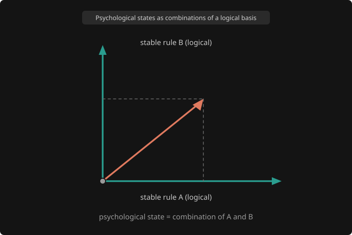
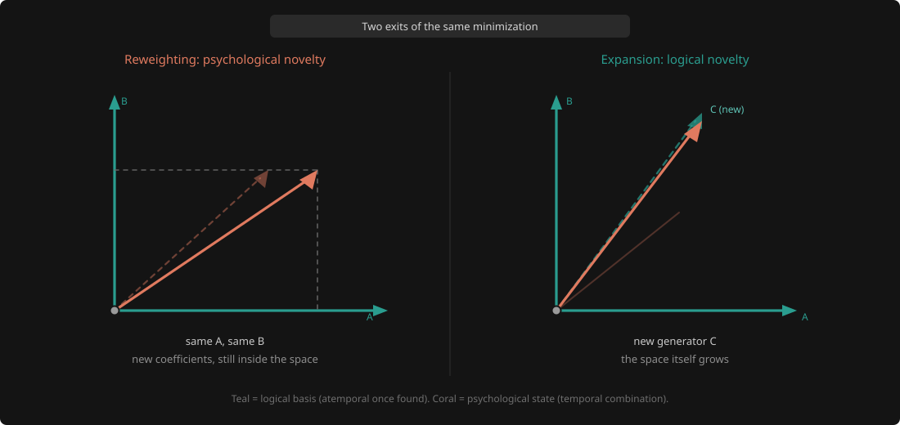

# A psychological state is a coefficient vector

Hamming’s two kinds of novelty are not two kinds of stuff. They are two things you can do with one set of building blocks: mix them differently, or add a new one.

## Hamming’s leftover question

I got stuck on two words in Richard Hamming’s *The Art of Doing Science and Engineering*: logical novelty and psychological novelty.

He mentions them in passing, in a chapter on machines and originality. A program working properly never produces logical novelty, because everything it does was already implied by what you wrote. It produces psychological novelty constantly. You are surprised by your own code. Then he turns the question on us. Much of human discovery looks the same: past experience led you there, the circumstances set it up. And once you fix the postulates, the definitions and the logic, he says, “all the rest of mathematics is merely psychologically novel.” He even asks whether logical novelty is possible at all.

We use the two words as if they were one. Psychological novelty is new **to you**: a thought you had never had, but one always within reach, because someone else already had it or you could have worked it out from what you knew. Logical novelty is new **to the space itself**. One visits a point in a space that already existed. The other makes the space bigger. Hamming’s question, put that way, is whether the second kind ever happens.

## New weights versus new directions

I started asking what it would take to make that difference precise, and it turned into a picture.

If “new to you” means a new mix of things you already have, then the things you already have sit there like a set of fixed directions. Call that set a basis. Every ordinary new thought is a new **coefficient vector**: a different mix of the same directions, a combination you had not worked out yet but that was always available. Logical novelty is not a new mix. It is a new **basis vector**, a direction that was not in the set, which makes more things reachable instead of visiting somewhere new inside what was already reachable.

That does not answer Hamming. It says what logical novelty would have to be: not a surprising combination, but the set of directions itself getting bigger.

## Storage, and time

The two layers store differently. A basis vector is cheap to keep, because you do not store what it produces. You store the rule and produce them again on demand. A coefficient is the reverse: cheap to make, expensive to keep, tied to a moment, gone unless something writes it down. Logical and psychological are not two kinds of content. They are two tiers of one storage system.

None of which is mine. The difference between keeping a lookup table and keeping a short program that regenerates it is the founding move of algorithmic information theory, and Kolmogorov complexity is the formal version of storing the generator rather than its consequences. Minimum description length is its practical descendant, and it makes the cost of missing structure concrete: you pay for the model plus whatever the model fails to explain, which in the usual examples is the difference between a description that grows like N and one that grows like log N.

The human version of this is time. A logical thing does not happen on a Tuesday. Whatever gets you 2+2=4 (the axioms, not the answer) is the same tomorrow. That is all I mean by timeless: not a separate world of non-physical objects, and not “maths never changes,” just that you do not have to work the rule out again when the clock moves.

A psychological state has a date on it. You live inside the mix: what is recent, what stands out, what happened just before, and the fact that it will fade. Grief has a date. The attachment and the loss it draws on are closer to generators, because they keep producing effects without being the feeling itself. You live through the weather. Generators are why you do not have to store every cloud.

This is also why hard science and social science can feel like different worlds without being made of different stuff. Physics spends most of its effort on rules that survive time, so the details can be thrown away. Much of social science has to keep the diary, because what it studies is tied to context and changes while you watch. That gap is about storage, not about reality, and it closes whenever someone finds structure that regenerates the pattern.

One warning, because it protects the distinction. A generator is timeless *once you have it*, but the set can still grow. If logical meant “never changes,” growth would be impossible, and we would be back to eternal rules sitting above mere feelings.

## The state is the recipe

Drawing it helps. A few fixed arrows from one origin, and any psychological state is a single arrow built by weighting them. The state **is** the recipe, and the dashed lines are the coefficients: how much of each generator is in play right now.

The teal axes do not move. They are the logical layer, timeless once found. The coral arrow has a date, and tomorrow it can point somewhere else while the generators stay put. The same shape turns up elsewhere under other names: a transformer’s attention weights against its fixed matrices, or sparse coding’s activations against its dictionary.

## Two exits

A basis does not arrive from nowhere, and neither does a new basis vector.

Take noisy experience and look for the cheapest structure that still explains it. Most of the time the search just adjusts weights on the basis you have. That is psychological novelty: cheap, constant, the ordinary churn of new mixes. Now and then no mix is good enough, and nothing you have explains the new data however you weight it. Then the system cannot adjust its way out. It has to add a direction.

On the left is a thought you could always have had: same A, same B, different recipe. On the right is the rarer move. A third generator appears because no mix of A and B lands where the state needs to be, and the coral arrow leaves the old plane only because the basis grew. So this is not a hierarchy with rule on top and feeling underneath. It is one loop with two exits, and whichever it takes, the result changes how the next round of experience gets read.

Which exit cannot be settled by how surprised you feel. It needs a cost: fit what you are seeing, but keep the structure small. With no penalty for growing, “add a direction” is always available and the distinction turns into taste. With a penalty, you grow only when squeezing the old directions harder would cost more than admitting a new one.

That cost is also what stops the picture from being a definition in disguise. Arrows and weighted sums are tidier than the real thing, and a few grammar rules will produce sentences nobody has ever said, which can look like the space growing when it has not. So “it was already reachable” cannot be the test on its own. The cost comparison can be.

## When an atom pays for itself

Sparse coding is the clearest place I know to watch it, because there the basis is a real object you can point at.

Say you are compressing small patches of photographs. You learn a dictionary: a few hundred atoms, mostly little edges and blobs, and any patch is written as a weighted sum of a handful of them. The dictionary is the basis, the weights are the coefficients, and in this one case the framing of this essay is not a metaphor. It is the data structure.

Now a new kind of patch starts turning up: a repeating texture, a weave, a patch of fur. Your edge atoms can still represent it, but it takes a lot of them with large weights, and it takes them every single time that texture appears. You have two options, and they are the two exits.

Keep the dictionary and pay in coefficients. Every patch of that texture is expensive to describe, and you pay again on the next one.

Or add an atom shaped like the texture. That costs a fixed amount once, since you have to store the atom and a bigger dictionary is a more complex model. After that each patch costs almost nothing: one atom, one weight.

The arithmetic decides. Total cost is the dictionary plus all the codes. Adding an atom raises the first part once and lowers the second part a little on every patch that uses it. So the decision does not turn on how strange the texture is. It turns on **how often it comes back**. Seen once, it stays a coefficient no matter how odd it looked. Seen ten thousand times, the atom pays for itself.

That is the most useful thing this framing buys, and it is not obvious. A one-off shock, however violent, is psychological. You absorb it as an expensive mix and move on. A modest pattern that keeps recurring is what earns a new generator. Frequency, not drama.

It also says when growing is wrong. Add an atom for every unusual patch and the dictionary swells into a list of everything you have seen, which is just storing the data again.

## The third move

There is an operation I left out, and it is the one that makes Hamming’s split hardest to hold.

Go back to the dictionary. Keep it exactly the same size, but swap the atoms for better ones. Nothing was added and the space it covers need not change, yet every patch now needs three atoms instead of eleven and the total cost drops sharply. Nothing grew and something real happened.

That is a change of basis, and it is neither exit. Not reweighting, because the generators themselves moved. Not growth, because nothing became reachable that was not reachable before. It is the same space, described better.

The everyday case is the numerals you are reading this in. Multiply MDXLVIII by XXIII, then multiply 1548 by 23. The same numbers were expressible both ways and nothing about arithmetic changed, but positional notation *is* a coefficient vector: 1548 is the weights 1, 5, 4, 8 against the generators 1000, 100, 10 and 1. Roman numerals are not, which is why IV and VI mean different things from the same two symbols. One honest complication. Positional notation needs a zero to hold an empty place and Roman numerals have none, so the historical shift was a bundle: one new generator, then a rebase the new generator made possible.

I think this is what most people mean by insight. A reframing feels like logical novelty, because the landscape looks different afterwards and you cannot unsee it. But no direction was added, so by the definition I have been using it is psychological. The honest reading is that Hamming’s two categories are not quite enough, and rebasing is what they leave out. It is still not a third exit, though. Rebasing sits on another axis: not what to do with the basis you have, but which coordinates you keep everything in.

It does share the economics of the second exit. Europe had Hindu-Arabic numerals from Fibonacci in 1202, kept its accounts in Roman for centuries, and in 1299 Florence’s money-changers banned the new ones outright. Changing basis costs relearning, retooling, and translating everything already written, so like a new atom it pays only if you will spend long enough in the new coordinates. A reframing you reach for once is not worth the move.

## Whose basis, and Hamming’s regress

Now the objection I owe Hamming.

Dictionary learning has “add an atom” built into it. The procedure was written in advance, and so was the range of atoms it can reach. So was the new atom ever really outside the space? Compared with Tuesday’s dictionary, yes, since no reweighting produced it. Compared with the range of all dictionaries the algorithm can reach, no. Read that way, growth is only reweighting one level up, and logical novelty disappears. Push it and it never stops: whatever produced your new generator was some capacity you already had, sitting inside some larger space you can name afterwards.

This is Hamming’s suspicion at full strength, and the vector picture does not refute it. I do not think anything does. You can always propose a bigger space in hindsight, which makes the absolute question, *is logical novelty possible at all, for anyone*, probably unanswerable rather than merely unanswered.

What the picture does is make the question answerable by making it relative. Novelty is logical or psychological **relative to a named basis**. That sounds like a retreat and I think it is the opposite, because what a system actually holds decides what things cost it. A texture that needs a new atom is, for that system with that dictionary, in a different class from one it can already code cheaply, and the difference shows up in bits rather than in intuition. There is a floor in practice too. A system with an unlimited range of possible atoms still has to find the atom that pays, and the search is where the expense lives.

Computation is the one place I know where this bottoms out in something firmer. The computable functions are closed under composition, so you cannot combine computable things and end up outside the set. Whatever a program does, however much it surprises the person who wrote it, was already reachable from the pieces it was built from. That puts a theorem under Hamming’s claim about machines rather than a hunch. (The closure is the theorem. Church–Turing, the claim that this covers everything we could mean by computable, is a thesis, because one side of it is an informal idea.)

It also sharpens the asymmetry he was circling. For machines the question is settled his way. For us it stays open only because nobody can write down what our basis covers, so nobody can show we cannot leave it. That is not evidence that we can.

Last, whose basis I mean, because it changes the mechanism. A person’s grows by learning. A field’s grows by argument, and by somebody refusing to accept the current framing. A formal system’s grows by stipulation. A trained model’s grows by optimization, or by an engineer. These are not the same process. What they share is the accounting: a small structure that regenerates, a state that weights it, and a decision about when squeezing the structure costs more than growing it. That is weaker than “it is all one mechanism,” and it is the claim I can defend.

## Active inference is an instance

I did not start from this rule and then hunt for examples. I got here by studying active inference.

Once the two exits were visible, the Free Energy Principle looked less like the source of the picture and more like a clear instance of it. There the generative model is the basis, current beliefs are the coefficients, parameter learning is the first exit, and structure learning is the second. Variational free energy is the cost: accuracy against complexity, the same trade the dictionary was making, written for agents that also act. Its three timescales separate things this essay has been running together. Inference of hidden states is fast and answers “where am I right now,” which is the coefficient vector. Parameter learning is slower, and it is reweighting. Structure learning is slowest, and it is the one that adds or prunes.

I should name the obvious risk. I have been reading this literature recently, and a framework you have just learned is the kind of thing you start seeing everywhere. By this essay’s own accounting that is dictionary bloat: a new atom reached for whether or not it pays. The test I would want applied to me is the one from the sparse coding case. Does it make the description cheaper? I think it does, and the reason I half trust that is the order I found things in. The two exits were visible in the dictionary before I mapped them onto structure learning.

## What the picture borrows

The storage argument was borrowed, and so is this one. Model-based reinforcement learning is what you get once you have a basis you can plan with. Model-free learning still learns, it just grinds through experience, because it never builds the thing that would let it generalize.

None of that follows from basis and coefficient. The picture does not prove it, it borrows it, and what it buys is bookkeeping: a question about two kinds of novelty and a question about compression turn out to be the same account, so results on one side are allowed to constrain talk on the other.

That is enough to give the distinction a stake. If a system only ever reweights and never grows, everything expensive stays expensive. Every situation the basis cannot cover is solved from scratch, at full price, again and again, each problem arriving disguised as new.

## Why it matters

Find a new generator and you have not finished discovering. You have opened a room.

Learn to drive and you have not made one new journey, you have a way of moving. The shop, a friend’s house, a road you have never taken: all psychological, new combinations of a skill you are no longer inventing. Hamming’s line about mathematics, read the other way round, says the same thing. Given the postulates, everything after is psychologically novel, and that is a large and useful space rather than a consolation prize.

The dictionary sharpens it. A generator is worth its cost in proportion to how often it gets reused, so the rooms worth opening are the ones you will spend a long time inside. That is a warning for anyone who likes the dramatic exit: a framework you invoke once is a bloated dictionary, not a discovery.

Anyone who has looked after a codebase has felt all three moves. A library is a basis and application code is coefficients. Refactoring is the change of basis: nothing new, everything cheaper afterwards. Adding a primitive is growth, and it pays only if it recurs, which is the whole argument against the helper you pulled out for a single call site.

It is also why a small model beats a long list of rules. Expert systems stored answers as rules, and when a case did not match, somebody wrote another rule. That is the expensive path, where every new instance becomes a generator and the dictionary swells exactly as predicted. Modelled inference does the opposite. Keep a small model, treat the situation in front of you as a weighting, and add structure only when no weighting of the old pieces will do. You do not have to stop using rules. You have to stop treating every solution as one.

## What’s mine, and what isn’t

Nothing here is new on its own. The novelty split is Hamming’s, algorithmic information theory got to the storage argument first, model-based reinforcement learning’s advantage is documented, sparse coding has been adding atoms for decades, and active inference already has names for both exits. What is mine is noticing they are the same account, with Hamming’s two kinds of novelty as the thread.

I still cannot tell him whether logical novelty is possible in the absolute sense. I have come to think that question has no answer, and that the relative one is the useful thing he left behind: not “is this new to the universe,” but “is this new to the basis you are holding, and what does it cost you to find out.”

If you are modelling something that has to live in noisy experience and still keep a cheap set of generators, look for the two exits. Reweighting is the common move. Growth is the rare one. The interesting systems are the ones that can tell the difference.
